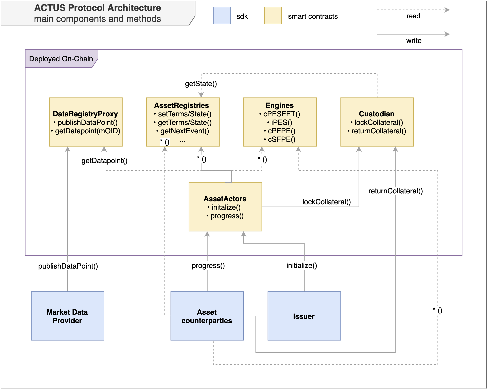

# Architecture

## Components

### Smart Contracts

A subset of the contracts, the _ACTUS Engines_ and the _ACTUS Core,_ implement the ACTUS financial contract standard. Its main features are creation of asset schedules from ACTUS contract terms and computing state progression. The remaining contracts facilitate asset registration, connection to external data \(oracles\), tokenization and other aspects related to the lifecycle of an asset on Ethereum.

### Typescript SDK \(Contract Bindings\) 

The SDK serves as a wrapper around the ACTUS Protocol smart contract system. It has handy convenience functions that abstract away complexity of formatting terms, generating schedules and interacting with contracts.

## The Inner Workings

To understand how the ACTUS Protocol components work together, let's go through a couple of exemplary tasks and discuss them using the illustration below. The tasks have been simplified for this purpose but they nevertheless should give you a good general feeling of the inner workings.

#### Issue an asset

When issuing an asset a transaction calling the `initialize` method of the _Asset Actor_ containing the asset terms, ownership information and the address of an _ACTUS Engine_.  The exact parameters vary slightly between the contract types.

#### Progress an asset

Progressing through the lifecycle of the asset is done via the `progress` method of the _Asset Actor_. It retrieves the terms and the current state of the asset from the _Asset Registry_ and uses the ACTUS _Engines_ to derives the requirements for the state transition of the asset. For example if a payment is necessary to progress the asset's state, it is executed by the _Asset Actor \(assuming allowances were set at time of execution\)._ 

#### Publish Market Data

Market Data Providers are whitelisted Ethereum accounts, e.g. decentralized oracles or trusted third parties that can publish data to the _Data Registry_ using the `publishDataPoint` method. They provide external data points needed for example for rate resets, determining the market value of underlying assets.

