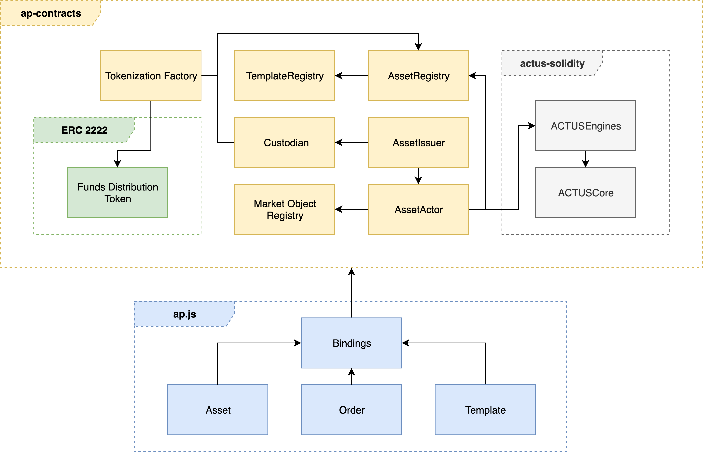

# Architecture

## Components

### ap.js

`ap.js` is a TypeScript library that serves as a wrapper around the ACTUS Protocol smart contract system. It has handy convenience functions that abstract away a large chunk of the complexity of issuing an asset, progressing its state and tokenization.

### ap-contracts

`ap-contracts` contains the smart contracts of the ACTUS Protocol smart contract system. It depends on `actus-solidity` and uses ACTUS definitions and ACTUS engines \(contract type specific state machines\) for computing the schedule, future states and obligations for ACTUS Protocol assets.

### actus-solidity

`actus-solidity` is an implementation of the ACTUS financial contract standard written in solidity. Its main features are creation of asset schedules from ACTUS contract terms and state progression.

## The Inner Workings

To understand how the ACTUS Protocol components work together, let's go through a couple of exemplary tasks and discuss them using the illustration below. The tasks have been simplified for this purpose but they nevertheless should give you a good general feeling of the inner workings.

#### Issue an asset

When issuing an asset a transaction containing a signed order object is sent to the _Asset Issuer_. If collateral is provided in the order the _Asset Issuer_ locks it in the _Custodian_ component. The _Asset Issuer_ then initializes the asset through the _Asset Actor,_  which in turn creates an entry in the _Asset Registry_. 

#### Progress an asset

To progress an asset the _Asset Actor_ is called through a transaction. It reads from the _Asset Registry_ and the ACTUS _Engines_ to verify the requirements for the state transition of the asset are met. If, for example, a payment is necessary to progress the asset's state, it is executed by the _Asset Actor \(assuming allowances where set at time of execution\)._ 

#### Publish Market Data

Market Data Providers are whitelisted Ethereum accounts, e.g. trusted third parties or decentralized oracles, that publish data to the _Market Object Registry_.

