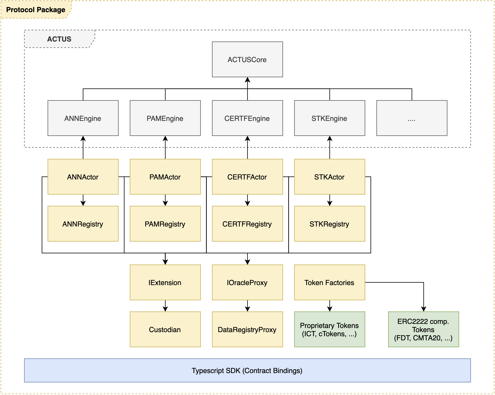

# Architecture

## Components

### Smart Contracts

A subset of the contracts, the ACTUS Engines and the ACTUS Core, implement the ACTUS financial contract standard. Its main features are creation of asset schedules from ACTUS contract terms and calculating state progression. The remaining contracts facilitate asset registration, connection to external data \(oracles\), tokenization and other aspects related to the life cycle of an asset on Ethereum.

### Typescript SDK \(Contract Bindings\) 

The SDK serves as a wrapper around the ACTUS Protocol smart contract system. It has handy convenience functions that abstract away complexity of formatting terms, generating schedules and interacting with contracts.

## The Inner Workings

To understand how the ACTUS Protocol components work together, let's go through a couple of exemplary tasks and discuss them using the illustration below. The tasks have been simplified for this purpose but they nevertheless should give you a good general feeling of the inner workings.

#### Issue an asset

When issuing an asset a transaction is sent to the `initialize()` method of the _Asset Actor_ containing the asset terms, ownership information and a reference to an _ACTUS Engine_. As a result, the asset is now registered in the Asset Registry. The exact parameter set for initialization vary slightly between the contract types.

#### Progress an asset

To progress an asset the _Asset Actor_ is called through a transaction. It reads from the _Asset Registry_ and the ACTUS _Engines_ to verify the requirements for the state transition of the asset. If, for example, a payment is necessary to progress the asset's state, it is executed by the _Asset Actor \(assuming allowances were set at time of execution\)._ 

#### Publish Market Data

Market Data Providers are whitelisted Ethereum accounts, e.g. decentralized oracles or trusted third parties that can publish data to the _Data Registry_ using the `publishDataPoint()` method. They provide data points that assets need for calculating payoffs, e.g. external interest rates. 

